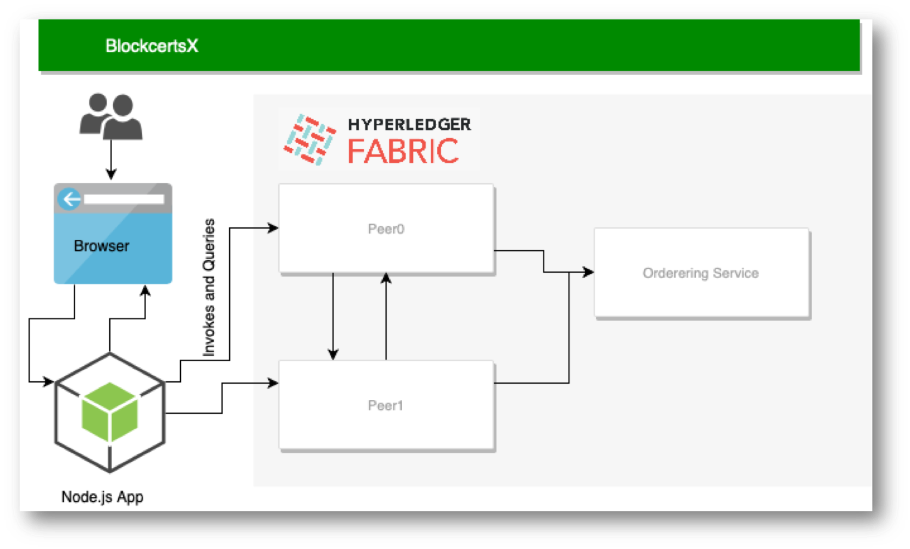

# BlockcertsX

BlockcertsX is a small proof-of-concept research project based off [Blockcerts](https://www.blockcerts.org/about.html). The issuance of digital certificates and other important documents using the blockchain is not something completely new. Organizations such as Open Certificates and Blockcerts already have accomplished this mission successfully.

Something worth noting regarding these implementations is their design choice of using the **Bitcoin** or **Ethereum** network to store the relevant authentication information. Instead of storing the authentication information in the network, **BlockcertsX** attempts to record the whole certificate in a permissioned network in which nodes would only accept issuance from accredited institutions. Both users and Issuers will interact with the network through a web application in which they can manage these digital certificates. This is also different from Blockcerts where the certificates are given to the recipients for them to keep, which might or might not be convenient for the recipient depending on how tech savvy they are.

In order to have a permissioned blockchain I used **Hyperledger Fabric** as the blockchain network for this project

# Implementation

The way this project was implemented is very straightforward from a high-level perspective. In a nutshell, BlockcertsX is a Node.js web application that communicates (using Node SDK for Hyperledger Fabric) with a fabric network that contains chaincode that is capable of receiving certificates and saving to the state of the blockchain.

The data flows the following way:

  1. An Issuer or User logs in into the web app using the front end.
  2. Node.js back-end translates the user actions into instructions to send to the network peers so that they can be endorsed. This instruction might contain the certificate data that will be written to the blockchain.
  3. The peer executes the instruction and submits the changes to the ordering service so they can be committed to the Blockchain
  4. The ordering service writes the blockchain state.

The certificate is retrieved the same way, except that we read from the state instead of writing to it.

The implementation of this project is heavily based on [**blockcerts**](https://github.com/IMSGlobal/cert-schema) schema and [**marbles**](https://github.com/IBM-Blockchain/marbles) from IBM-Blockchain.

# Running the Demo

In order to first run the demo, we must download an up to date version of the [fabric-samples]('https://github.com/hyperledger/fabric-samples') repository. We'll leverage the provided sample networks in which we will piggyback the BlockcertsX application.

## Setting up the Hyperledger Fabric network.

#### In the Fabric-Samples Repository:

  1. Open a Terminal
  2. First, let's clean up to make sure that previous runs of this demo or any other examples using Hyperledger Fabric don't interfere.

      `cd fabric-samples/basic-network`

      `sudo ./teardown.sh`

  3. Go to fabric-samples/fabcar directory:

      `cd fabric-sample/fabcar`

  4. run the following scripts in order:

      `sudo ./startFabric.sh`

      `node enrollAdmin.js`

      `node registerUser.js`

  5. At this point, all of the docker containers should have been created and are running. Notice that this includes the chaincode container for the fabcar example provided by **fabric-samples**. To see the containers simply run:

      `docker ps`

      from any directory.

### Running BlockcertsX

  1. Open a 2nd Terminal and go to the blockcertx/scripts directory

      `cd blockcertx/scripts`

  2. run the install chaincode script to upload the chaincode found in chaincode/src/blockcertx

      `node install_chaincode.js`

  3. run the instantiation script to:
    - instantiate the chaincode
    - run an invoke method that will save the certificate test.json into the network.

      `node instantiate_chaincode.js`

  4. run the read certificate script to retrieve the certificate from state and save it into the downloads folder.

      `node read_cert.js`

  5. At this point the certificate should have been retrieved from the blockchain state.
